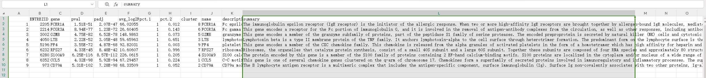

# Basic Preprocessing and Clustering

This chapter is the fastest way to get a feel for the package. If you are new to `sclet`, think of it as the equivalent of the classic PBMC tutorial: read the data, perform quality control, normalize, identify highly variable genes, reduce dimensions, cluster cells, and inspect marker genes.

The difference is that everything happens directly on top of `SingleCellExperiment`, with `sclet` providing a coherent high-level analysis interface. The goal here is not only to reproduce a standard workflow, but also to show how little boilerplate is needed once the state-aware design is in place.

```{r pbmc-data, include=FALSE}
knitr::opts_chunk$set(warning = FALSE,
                      message = TRUE)

f <- "data/pbmc-3k-sce.rds"
pbmc <- readRDS(f)
```

## Read 10X data

```{r readdata, eval = eval_chunks && requireNamespace("TENxPBMCData", quietly = TRUE)}
library(sclet)
pbmc_10x <- TENxPBMCData::TENxPBMCData("pbmc3k")
pbmc_10x
```

If you are starting from a local Cell Ranger directory instead, the corresponding `sclet` call is simply `pbmc <- Read10X("filtered_feature_bc_matrix/")`.


## QC

```{r vlnplot-qc, fig.width=10, fig.height=7.5}
# colData(pbmc)$percent.mt <- PercentageFeatureSet(pbmc, "^MT-")
pbmc[["percent.mt"]] <- PercentageFeatureSet(pbmc, "^MT-")
VlnPlot(pbmc, features = c("nFeature_RNA", "nCount_RNA", "percent.mt"))
```


```{r subset-pbmc}
subset_feature(pbmc, 10)
pbmc <- subset_feature(pbmc, mincell = 3, peek=FALSE)

keep <- colData(pbmc)$nFeature_RNA > 200 &
    colData(pbmc)$nFeature_RNA < 2500 &
    colData(pbmc)$percent.mt < 5
pbmc <- pbmc[, keep, drop = FALSE]
pbmc
```


```{r featurescatter-qc, fig.width=10, fig.height=7.5}
plot1 <- FeatureScatter(pbmc, feature1 = "nCount_RNA", feature2 = "percent.mt")
plot2 <- FeatureScatter(pbmc, feature1 = "nCount_RNA", feature2 = "nFeature_RNA")

library(aplot)
plot_list(plot1, plot2)
```


Users can also use `plotColData()` to visualize the QC data.

```{r plotcoldata-qc, fig.width=10, fig.height=7.5}
# VlnPlot-like
p1 <- plotColData(pbmc, y = 'nCount_RNA')

# FeatureScatter-like
p2 <- plotColData(pbmc, x = "nCount_RNA", y = "percent.mt")
plot_list(p1, p2)
```


## Ambient RNA and doublet cleanup

Quality control thresholds remove obvious outliers, but they do not solve two common single-cell annoyances: ambient RNA contamination and doublets. `sclet` now exposes both through `SingleCellExperiment`-native wrappers, so the outputs stay in `colData` or new assays instead of being scattered across ad hoc objects.

```{r pbmc-cleaning-advanced, eval = eval_chunks && requireNamespace("scDblFinder", quietly = TRUE) && requireNamespace("celda", quietly = TRUE)}
pbmc_clean <- pbmc[, seq_len(min(400, ncol(pbmc)))]

pbmc_clean <- RunDoubletFinder(pbmc_clean)
table(pbmc_clean$scDblFinder.class)

pbmc_clean <- RunDecontX(pbmc_clean)
assayNames(pbmc_clean)
head(pbmc_clean$decontX_contamination)
```

`RunDoubletFinder()` writes doublet calls back to `colData`, while `RunDecontX()` keeps the decontaminated matrix isolated in `assay(pbmc_clean, "decontXcounts")`. That separation matters, because it lets you compare raw and cleaned views instead of quietly overwriting the original counts.


## Variable features

```{r variablefeatureplot-pbmc, fig.width=10, fig.height=7.5}
pbmc <- FindVariableFeatures(pbmc, method = "scran")
top10 <- head(VariableFeatures(pbmc, method = "scran"), 10)
top10
VariableFeaturePlot(pbmc, label = top10, method = "scran")
```

## Zero-preserving imputation

If you want a denoised expression view for visualization or downstream ranking, `RunImputation()` adds a zero-preserving ALRA layer without contaminating the original `counts` or `logcounts`. In other words, this is an extra view of the data, not a silent replacement of the baseline matrix.

```{r pbmc-imputation, eval = eval_chunks && requireNamespace("ALRA", quietly = TRUE)}
pbmc_impute <- pbmc[, seq_len(min(400, ncol(pbmc)))]
pbmc_impute <- NormalizeData(pbmc_impute)
pbmc_impute <- RunImputation(pbmc_impute, assay = "logcounts")

assayNames(pbmc_impute)
Layers(pbmc_impute)
DefaultLayer(pbmc_impute)
```

The imputed output is stored as `alra_imputed`, so downstream code can opt into it explicitly instead of being forced into a globally smoothed workflow.

## Dimensional reduction

```{r elbowplot-pbmc, fig.width=10, fig.height=7}
pbmc <- ScaleData(pbmc)
pbmc <- RunPCA(pbmc, subset_row = VariableFeatures(pbmc, method = "scran"), layer = "scaled")
ElbowPlot(pbmc)
```

Here the PCA step is intentionally pointed to the logical `scaled` layer. In current `sclet`, this is the recommended way to declare which expression view should drive the downstream reduction, instead of hard-coding the underlying assay name.

## Clustering {#FindClusters}

```{r}
set.seed(2024-10-01)
pbmc <- FindNeighbors(pbmc, dims = 1:10)
pbmc <- FindClusters(pbmc, resolution = 0.88)

head(Idents(pbmc), 5)
```


## UMAP
```{r umap-pbmc, fig.width = 13, fig.height=7.5}
pbmc <- RunUMAP(pbmc, 1:10)

library(aplot)
# DimPlot delegates to ggsc::sc_dim
p1 <- DimPlot(pbmc, reduction="PCA")
p2 <- DimPlot(pbmc, reduction="UMAP")

plot_list(gglist = list(PCA=p1, UMAP=p2))
```

## Find Markers

```{r find-markers-2}
# find all markers of cluster 2
cluster2.markers <- FindMarkers(pbmc, ident.1 = 2)
head(cluster2.markers, n = 5)
```

```{r find-markers-5}
# find all markers distinguishing cluster 5 from clusters 0 and 3
cluster5.markers <- FindMarkers(pbmc, ident.1 = 5, ident.2 = c(0, 3))
head(cluster5.markers, n = 5)
```

```{r find-all-markers}
# find markers for every cluster compared to all remaining cells, 
# report only the positive ones
library(dplyr)
pbmc.markers <- FindAllMarkers(pbmc, only.pos = TRUE)

topN_marker <- function(markers, n) {
    markers %>%
        group_by(cluster) %>%
        dplyr::filter(avg_log2FC > 1) %>%
        slice_head(n = n) %>%
        ungroup()
}

top10 <- topN_marker(pbmc.markers, 10)
split(top10$gene, top10$cluster)
```

### Marker gene information

```{r marker-genes}
top1 <- topN_marker(pbmc.markers, 1)

gene_table <- gene_summary_table(top1, gene_col = 'gene', 
    cluster_col = 'cluster', keyType='SYMBOL', output = "data.frame")

gene_table
```



## Cell cluster annotation {#manual-annotation}

```{r umap-pbmc-cell}
new_labels <- c(
    "1" = "Naive CD4+ T", 
    "2" = "B", 
    "3" = "Memory CD4+", 
    "4" = "CD14+ Mono", 
    "5" = "NK", 
    "6" = "CD8+ T", 
    "7" = "Stress Response / Malignant Cells", 
    "8" = "FCGR3A+ Mono", 
    "9" = "Myeloid / Neutrophil"
)
pbmc <- RenameIdents(pbmc, new_labels)
DimPlot(pbmc, reduction="UMAP") + ggsc::sc_dim_geom_label()
```

## Automatic Annotation (SingleR)

sclet provides `RunSingleR` to easily perform automatic annotation using SingleR.

```{r run-singler, eval = eval_chunks && requireNamespace("SingleR", quietly = TRUE) && requireNamespace("celldex", quietly = TRUE)}
# This requires SingleR and celldex packages.
hpca <- celldex::HumanPrimaryCellAtlasData()
pbmc2 <- RunSingleR(pbmc, ref = hpca, labels = hpca$label.main)

# or be explicit about the expression layer used for annotation
pbmc2 <- RunSingleR(pbmc, ref = hpca, labels = hpca$label.main, layer = "logcounts")

# View the results
head(pbmc2$SingleR_labels)
get_mapping(pbmc2)

# Visualize
DimPlot(pbmc2, reduction="UMAP") + 
    ggplot2::aes(color = SingleR_labels)
```

`RunSingleR()` now follows the same layer contract as the rest of the package. If you do not specify `layer`, it resolves from `DefaultLayer(pbmc)` and falls back to a non-scaled expression source when needed.

In addition to writing annotation labels back to `colData`, it also records a lightweight reference-mapping state that you can inspect with `get_mapping(pbmc)`.


